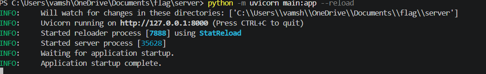
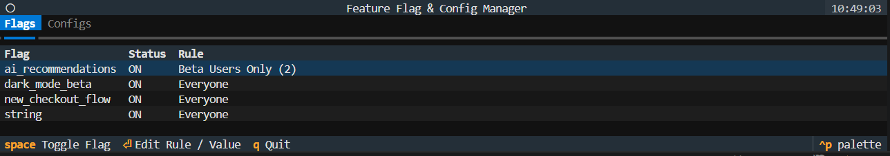
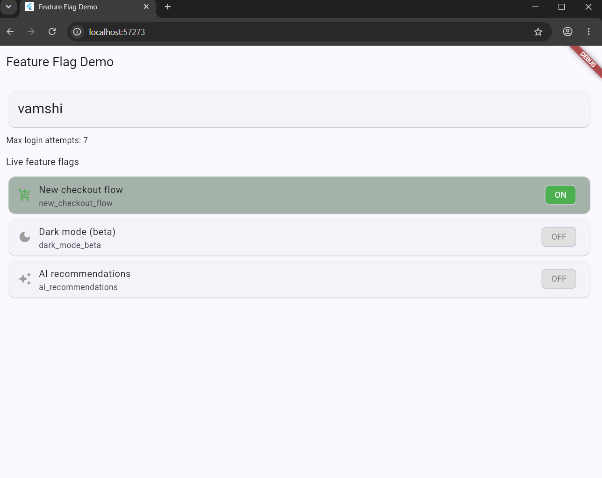

# Feature Flag & Remote Config Engine

A small, self-hosted "remote control" for your app. Flip a switch in a
terminal dashboard and watch a connected Flutter app update **instantly** —
no rebuild, no restart, no app store release.

## What's included

```
feature-flag-engine/
├── backend/                 # FastAPI server + SQLite database
│   ├── main.py              # REST API + WebSocket (real-time push)
│   ├── database.py          # SQLite storage
│   ├── evaluation.py         # Decides who a flag is ON for
│   ├── models.py             # Shared data shapes
│   └── requirements.txt
├── tui/                      # Terminal dashboard (the "control plane")
│   ├── app.py
│   └── requirements.txt
└── flutter_client/
    ├── feature_flag_client/  # Reusable Dart/Flutter package
    │   ├── pubspec.yaml
    │   └── lib/
    │       ├── feature_flag_client.dart
    │       └── src/
    │           ├── client.dart
    │           └── models.dart
    └── example_app/
        ├── main.dart              # Drop-in example screen
        └── pubspec_snippet.yaml   # Dependency lines to add
```

## How it fits together

1. **Backend** — a tiny FastAPI server that stores feature
   flags and remote configs in SQLite. It exposes a REST API to read/edit
   them, and a WebSocket (`/ws`) that broadcasts the full state to every
   connected client the instant something changes.
2. **TUI** — a terminal dashboard built with [Textual](https://textual.textualize.io/).
   here we uses to flip flags and edit configs.
3. **Flutter client**  — a small package of our app
   imports. It connects to the backend, keeps a live copy of all flags and
   configs, and tells you whether a flag is ON for the current user.

``` 
 ┌──────────────┐        REST + WebSocket        ┌──────────────────┐
 │  Terminal     │ ───────────────────────────▶  │   FastAPI         │
 │  Dashboard    │ ◀───────────────────────────  │   Backend         │
 │  (tui/app.py) │      live state pushes         │   + SQLite        │
 └──────────────┘                                 └─────────┬─────────┘
                                                              │ WebSocket
                                                              ▼
                                                    ┌──────────────────┐
                                                    │  Flutter App      │
                                                    │  (your app +      │
                                                    │  feature_flag_    │
                                                    │  client package)  │
                                                    └──────────────────┘
```


- we used **Python 3.14** (for the backend and the TUI)
- we used **Flutter SDK 3.44** (only needed for the client app step)

---

## Step 1 — Run the backend

```bash
python -m uvicorn main:app --reload
 ##this will run the backend
##screen shot of the backend 
---

## Step 2 — Run the terminal dashboard

In a **new** terminal:

```bash
python app.py
```
screen shot of the dash board  

we will  see something like:

```
==================================================
 FEATURE FLAG & CONFIG MANAGER
==================================================
 Flag                  Status  Rule
 new_checkout_flow     ON      Beta Users Only (2)
 dark_mode_beta        OFF     Everyone
 ai_recommendations    ON      10% Rollout

 [Tab] Switch View | [Space] Toggle Flag
 [Enter] Edit Rule | [Q] Quit
==================================================
```

**Controls:**

| Key     | Action                                                            |
|---------|--------------------------------------------------------------------|
| `Tab`   | Switch between the **Flags** tab and the **Configs** tab          |
| `↑ / ↓` | Move the selection up/down                                         |
| `Space` | Toggle the highlighted flag ON/OFF                                  |
| `Enter` | Edit the highlighted flag's rule (or config's value)               |
| `Q`     | Quit                                                                |

When we press `Enter` on a flag, a small form pops up where you can set
its rule:

- `everyone` — flag applies to all users
- `beta_only` — flag applies only to the user IDs you list (comma separated)
- `percentage` — flag applies to a consistent percentage (0–100) of users

If the backend isn't running on `localhost:8000`, point the TUI at it with:

```bash
FF_API_URL=http://192.168.1.50:8000 python app.py
```

---

## Step 3 — Connect a Flutter app


now we will run the example fultter app:

   ```bash
   flutter clean
   flutter pub get
   flutter run -d chrome
   ```
  flutter example app in chrome ## 


we will see a screen listing the three demo flags, each showing **ON** or
**OFF**, plus the live `welcome_message` and `max_login_attempts` values.

---

## Step 4 — Watch it update in real time

With the backend, the TUI, and the Flutter app all running:

1. In the TUI, highlight `dark_mode_beta` and press `Space`.
2. Watch the Flutter app — the "Dark mode (beta)" tile flips to **ON**
   immediately, with no refresh or restart.
3. Try editing `welcome_message` (press `Enter` on the Configs tab) — the
   headline text in the Flutter app updates live too.
4. Try the rollout rules: change `ai_recommendations` to `percentage` with
   a value of `50`, then change the `userId` in `main.dart` to a few
   different strings and re-run — about half of them will see it ON, and
   each specific user ID will *consistently* land on the same side every
   time (that's the point of a percentage rollout).

---

## How rollout rules work

| Rule type    | Behaviour                                                                 |
|--------------|------------------------------------------------------------------------------|
| `everyone`   | Flag is ON for every user (as long as `enabled` is `true`).                |
| `beta_only`  | Flag is ON only for user IDs listed in `beta_user_ids`.                    |
| `percentage` | Flag is ON for a consistent ~X% of users, based on a hash of `flag_name + user_id`. The same user always lands in the same bucket. |

The same hashing logic is implemented in both `backend/evaluation.py`
(Python) and `flutter_client/feature_flag_client/lib/src/models.dart`
(Dart), so the result is identical whether the decision is made on the
server or on the device.

---

## API reference

All endpoints are served at `http://<host>:8000`.

| Method | Path                         | Description                              |
|--------|------------------------------|--------------------------------------------|
| GET    | `/api/state`                 | All flags + all configs                   |
| GET    | `/api/flags`                 | List all flags                            |
| GET    | `/api/configs`               | List all configs                          |
| GET    | `/api/evaluate/{name}?user_id=...` | Is this flag ON for this user?      |
| POST   | `/api/flags`                 | Create/replace a flag                     |
| PATCH  | `/api/flags/{name}/toggle`   | Flip a flag ON/OFF                        |
| PUT    | `/api/flags/{name}/rollout`  | Update a flag's targeting rule            |
| DELETE | `/api/flags/{name}`          | Remove a flag                             |
| POST   | `/api/configs`               | Create/replace a config                   |
| PUT    | `/api/configs/{key}`         | Update a config's value                   |
| DELETE | `/api/configs/{key}`         | Remove a config                           |
| WS     | `/ws`                        | Live push of `/api/state` on every change |

All of this is also browsable and testable at `/docs` (Swagger UI).

---

## team split (2 members)

- **sasank — Backend & TUI (Python):** `backend/` and `tui/`. Owns the
  data model, REST API, WebSocket broadcasting, and the terminal dashboard.
- **vamshi — Client integration (Flutter):** `flutter_client/`. Owns the
  package's HTTP/WebSocket logic, the rollout-evaluation port to Dart, and
  the example app demo.
  we both contributed our ideas on the whole project

Agree on the JSON shapes in `backend/models.py` first — everything else
(the TUI's table rendering and the Dart models) is built directly from
that contract, so the two halves can be built in parallel.

---


## Possible extensions

- Add buttons in the TUI to **create** new flags/configs (the API already
  supports `POST /api/flags` and `POST /api/configs`).
- Add a simple **auth token** check on the write endpoints if you're
  running this on a shared network.
- Persist **audit history** (who changed what, and when) in a new SQLite
  table.
- Build a minimal **web dashboard** as an alternative to the TUI, reusing
  the same REST/WebSocket API.
